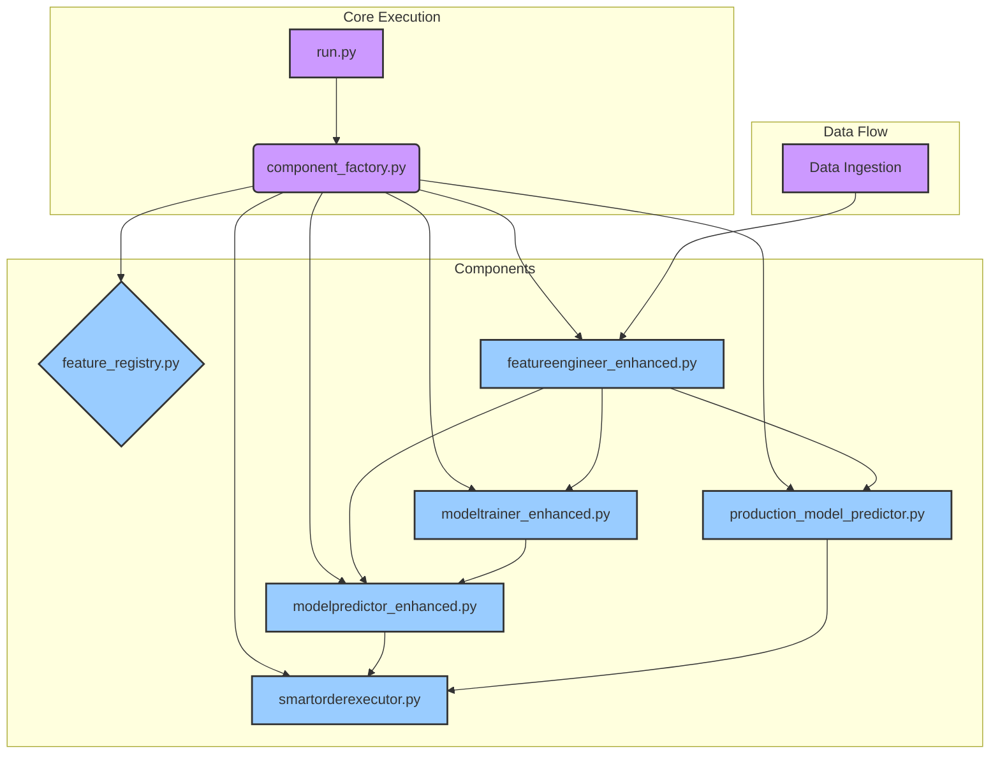

# Codebase Redundancy and Structure Report

This report analyzes the codebase to identify redundant files and clarify the core application structure. The goal is to streamline the project for future development and prepare for moving essential components to a new `Try` branch.

## Core Architecture Diagram

The following diagram illustrates the primary components of the trading application and their relationships. The system is orchestrated by `run.py`, which uses a `component_factory.py` to manage dependencies.

## Core Components to Retain

These files form the backbone of the application and should be preserved:

-   `run.py`: The main entry point for paper and live trading.
-   `cli.py`: The command-line interface for managing the application (though it may need updates to work with `run.py` instead of the non-existent `main.py`).
-   `component_factory.py`: Manages dependency injection and component lifecycle.
-   `feature_registry.py`: Centralized registry for feature definitions.
-   `featureengineer_enhanced.py`: The primary feature engineering module.
-   `modeltrainer_enhanced.py`: The primary model training module.
-   `modelpredictor_enhanced.py`: The primary model prediction module.
-   `production_model_predictor.py`: The predictor for the production ensemble model.
-   `smartorderexecutor.py`: The primary order execution module.
-   `config.yaml`: The main configuration file.
-   `.env.example`: Template for environment variables.
-   `requirements.txt`: Project dependencies.

## Identified Redundant Files and Directories

The following files and directories are recommended for removal. They appear to be outdated, experimental, for one-off tasks, or are backups that are no longer needed.

### 1. Outdated Core Component Implementations

These files appear to be older or alternative versions of the core components. The "enhanced" versions are now used.

-   `featureengineer.py`
-   `featureengineer_hht.py`
-   `modeltrainer.py`
-   `modelpredictor.py`
-   `datahandler.py`
-   `database.py` (functionality is now within `component_factory` and `modeltrainer_enhanced`)
-   `labelgenerator.py`
-   `advancedriskmanager.py`
-   `improved_order_executor.py`
-   `smartorderexecutor_ml_enhanced.py`

### 2. One-Off Scripts, Debugging, and Testing Scripts

These scripts seem to be for specific, one-time tasks and are not part of the core application logic.

-   `add_missing_features.py`
-   `analyze_feature_importance.py`
-   `apply_migrations.py`
-   All files starting with `check_*.py`
-   All files starting with `fix_*.py`
-   All files starting with `diagnose_*.py`
-   All files starting with `test_*.py` (These should be moved to a dedicated testing framework if they are still relevant).
-   `afternoon_test_plan.py`
-   `backtest_enhanced.py`
-   `create_fresh_database.py`
-   `create_fresh_venv.py`
-   `create_full_mock_data.py`
-   `debug_features.py`
-   `debug_trading.py`
-   `direct_websocket_data.py`
-   `emd_performance_benchmark.py`
-   `enhanced_features_documentation.py`
-   `execution_analytics.py`
-   `fast_live_data.py`
-   `hft_microstructure_emd_example.py`
-   `hht_performance_benchmark.py`
-   `install_and_test_emd_packages.py`
-   `integrate_improved_executor.py`
-   `migrate_to_enhanced_features.py`
-   `missing_features_migration_list.py`
-   `normalize_targets.py`
-   `pandas_emd_integration_example.py`
-   `purge_testnet_data.py`
-   `pyemd_hft_benchmark.py`
-   `quick_*.py` (all of them)
-   `run_emd_tests.py`
-   `run_enhanced_analysis.py`
-   `run_validation_mode.py`
-   `simple_emd_test.py`
-   `train_live_model.py`
-   `train_production_model.py`
-   `train_production_model_sklearn.py`
-   `update_existing_systems_example.py`
-   `validate_improved_executor.py`
-   `verify_*.py` (all of them)
-   `websocket_live_data.py`

### 3. Backup and Archive Directories/Files

These are backups and should be removed from the main branch.

-   `ARCHIVE/`
-   `BACKUP_SPRINT_*/`
-   `backup_before_cleanup/`
-   `model_backup_*/`
-   `config_backup_*.yaml`
-   `l2_data_archive/`

### 4. Old Model and Data Files

These appear to be outdated model files, features, or results.

-   `lgbm_model_*.txt`
-   `lgbm_model_*.json`
-   `model_features_*.json`
-   `enhanced_features_summary.json`
-   `execution_test_results.json`
-   `feature_importance_data.json`
-   `feature_validation_report.json`
-   `integration_test_results_*.json`
-   `market_conditions_report.json`
-   `migration_report.json`
-   `optuna_training_results.json`
-   `test_results.json`
-   `verification_report.json`

### 5. Outdated Documentation and Reports

These text and markdown files seem to be notes or reports from previous development sprints. They should be archived or removed.

-   `2025-08-04-*.txt`
-   `ADDITIONAL_SUGGESTIONS_*.txt`
-   `agent_*.md` / `*.txt`
-   `CLAUDE_*.md`
-   `CONSOLIDATION_COMPLETE.md`
-   `consolidation_progress.md`
-   `cursor_*.md`
-   `DATA_INGESTOR_REFACTOR_SUMMARY.md`
-   `DEBUG*.txt`
-   `DEPLOYMENT_STATUS.md`
-   `EMD_*.md`
-   `ENHANCED_*.md`
-   `FEATURE_INTEGRATION_*.md`
-   `FINAL_SYSTEM_STATUS_REPORT.md`
-   `FIXES_SUMMARY.md`
-   `HANDOVER.md`
-   `HHT_L2.md`
-   `ingest_log.txt`
-   `l2_database_migration_analysis.md`
-   `migration_*.txt`
-   `ml_*.md`
-   `PRICE_FIX_SUMMARY.md`
-   `Priority_*.md`
-   `PROJECT_PLAN.md`
-   `QUICK_START.md`
-   `README.md` (This should be reviewed and potentially updated, but the current one might be outdated)
-   `READY_TO_START.md`
-   `REFACTOR_PLAN.md`
-   `SETUP_INSTRUCTIONS.md`
-   `SPRINT_*.md`
-   `Team_Structure.md`
-   `TRADING_*.md` / `*.txt`
-   `UNICODE_FIX_GUIDE.md`

## Recommendations

1.  **Create a `Try` branch:** Before deleting any files, create a new branch named `Try`.
2.  **Push Core Components:** Add and commit the core components identified in this report to the `Try` branch.
3.  **Delete Redundant Files:** Remove the files and directories listed above from the `Try` branch.
4.  **Test:** Thoroughly test the application on the `Try` branch to ensure all functionality is intact.
5.  **Update `cli.py`:** Modify `cli.py` to call functions in `run.py` or `component_factory.py` directly, instead of `main.py`.
6.  **Merge:** Once testing is complete, the `Try` branch can be merged back into the main development branch.

This cleanup will significantly reduce the complexity of the codebase, making it easier to maintain and develop in the future.
